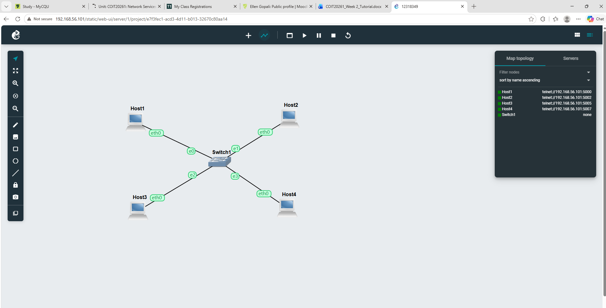
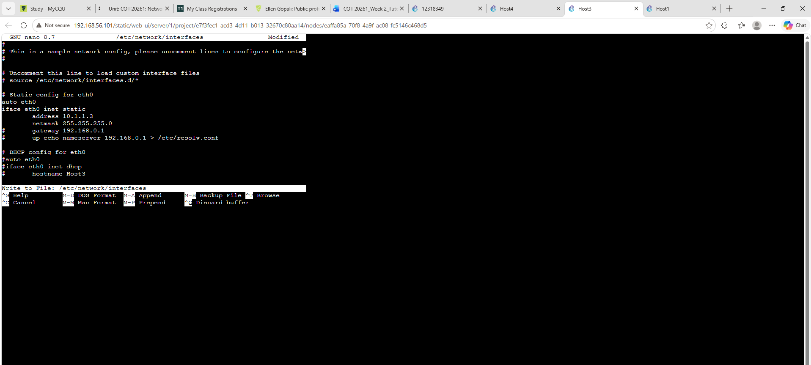
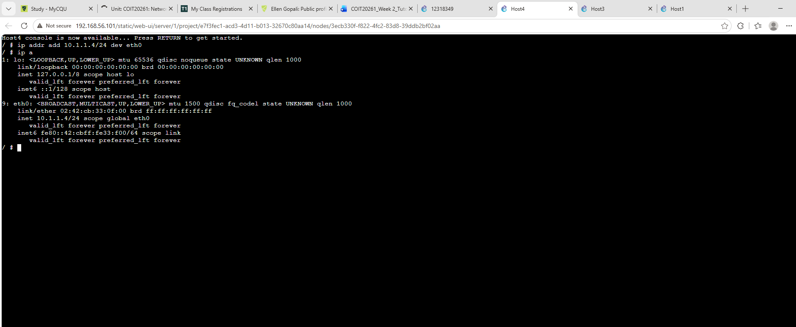
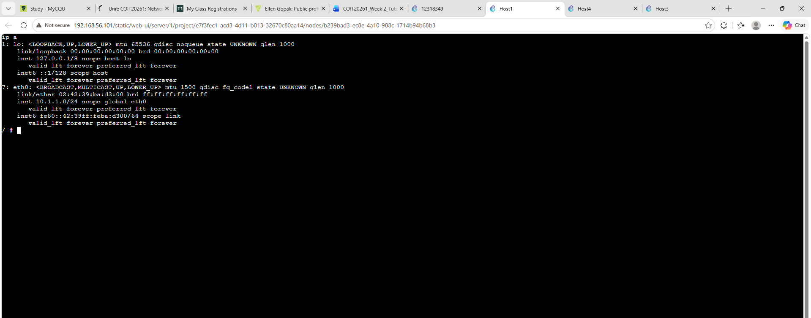
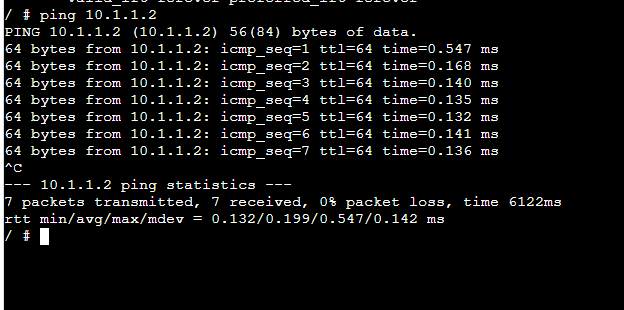

# COIT20261 Network Services and Automation
## Week 02 Tutorial Journal

### Task 1: Setting Static IP Addresses

#### Aim

The aim of this task was to learn different ways of configuring static IP addresses on Linux hosts and to check whether the IP addresses were configured correctly.

---

### 1. Network Setup

I created a GNS3 project with four Linux hosts named **Host1, Host2, Host3 and Host4**. I connected all four hosts to **Switch1** to create a LAN.





**Figure 1: GNS3 network topology with four Linux hosts connected to Switch1.**

I used the `10.1.1.0/24` IPv4 network for this activity.

---

### 2. Configuring Static IP Addresses

I configured static IP addresses on the hosts using different methods. This allowed me to practise both configuration-file-based and command-line IP configuration.

For some hosts, the IP address was configured through the GNS3 configuration. For the remaining hosts, I configured the addresses manually from the Linux console.

---

### 3. Configuring Host3 Using /etc/network/interfaces

For Host3, I opened the Linux console and edited the network interfaces file using:

```bash
nano /etc/network/interfaces
```

I configured the `eth0` interface with the following static IP information:

```text
auto eth0
iface eth0 inet static
    address 10.1.1.3
    netmask 255.255.255.0
```



**Figure 2: Configuring the static IP address of Host3 using /etc/network/interfaces.**

This method stores the network configuration inside the interfaces file. After changing the configuration, the interface can be restarted so that the new settings take effect.

---

### 4. Configuring Host4 Using the ip Command

For Host4, I used the `ip addr add` command instead of editing the interfaces file.

I entered:

```bash
ip addr add 10.1.1.4/24 dev eth0
```

I then checked the interface using:

```bash
ip a
```



**Figure 3: Host4 showing the configured IP address 10.1.1.4/24.**

The output showed:

```text
inet 10.1.1.4/24 scope global eth0
```

This confirmed that the IP address was successfully assigned to the `eth0` interface.

I learned that using the `ip addr add` command applies the IP address immediately. However, this type of configuration is temporary and may not remain after the host is restarted.

---

### 5. Checking the IP Configuration

After configuring the hosts, I used the following command to check their network interfaces:

```bash
ip a
```

For example, I checked Host1 and confirmed that an IPv4 address was assigned to its `eth0` interface.



**Figure 4: Checking the IP configuration of Host1 using the ip a command.**

Using `ip a` was useful because it displayed the interface name, IPv4 address, subnet mask and other interface information.

---

## Task 2: Testing Network Connectivity and Delay with Ping

### Aim

The aim of this task was to use the `ping` command to check whether another device on the network was reachable and to observe the network delay using round-trip time.

---

### 1. Testing Connectivity

After configuring the IP addresses, I tested communication between the hosts.

I used:

```bash
ping 10.1.1.2
```

The destination host responded successfully.



**Figure 5: Successful ping test to 10.1.1.2.**

I allowed several replies to be received and then stopped the ping using `Ctrl + C`.

The summary showed:

```text
7 packets transmitted, 7 received, 0% packet loss
```

This means that all seven ICMP packets sent to the destination received a response. Therefore, the connection between the two hosts was working correctly.

---

### 2. Understanding Round-Trip Time

The ping result also displayed:

```text
rtt min/avg/max/mdev = 0.132/0.199/0.547/0.142 ms
```

The average round-trip time was approximately **0.199 ms**.

RTT represents the time required for a packet to travel from the source host to the destination and for the response to return.

The low RTT in this test was expected because the hosts were connected within the same simulated LAN.

---

### 3. Ping to an Incorrect IP Address

The tutorial also required testing an IP address that does not exist on the network.

A command such as the following can be used:

```bash
ping 10.1.1.100
```

If the destination does not exist or cannot be reached, no successful reply will be received. This test is useful for understanding packet loss and identifying connectivity problems.

**Screenshot still required:** Add the screenshot of your ping to the incorrect/non-existing IP address here.

```markdown


**Figure 6: Ping test to an incorrect IP address.**
```

---

### 4. Testing Different Ping Options

I also needed to test how different command-line options change the behaviour of `ping`.

For example, the number of packets can be limited using:

```bash
ping -c 5 10.1.1.2
```

The interval between packets can be changed using:

```bash
ping -i 2 10.1.1.2
```

The data size can also be changed using:

```bash
ping -s 100 10.1.1.2
```

These options can also be combined, for example:

```bash
ping -c 3 -s 80 10.1.1.2
```

This allows me to control how many packets are sent and the amount of data included in the ping request.

**Screenshot still required:** Add your screenshot after running a ping command with non-default options.

```markdown


**Figure 7: Ping test using non-default command-line options.**
```

---

## What I Learned

From this week's tutorial, I learned how to build a simple LAN in GNS3 and configure static IPv4 addresses on Linux hosts.

I practiced different methods of assigning an IP address, including editing the `/etc/network/interfaces` file and using the `ip addr add` command. I also learned how to use `ip a` to check whether an address had been assigned correctly.

The second task helped me understand how `ping` can be used to test connectivity between network devices. I learned that receiving ping replies confirms that the destination is reachable. I also learned how packet loss and round-trip time can provide useful information about network connectivity and delay.

Overall, this tutorial gave me more practical experience with Linux IP configuration and basic network troubleshooting.
