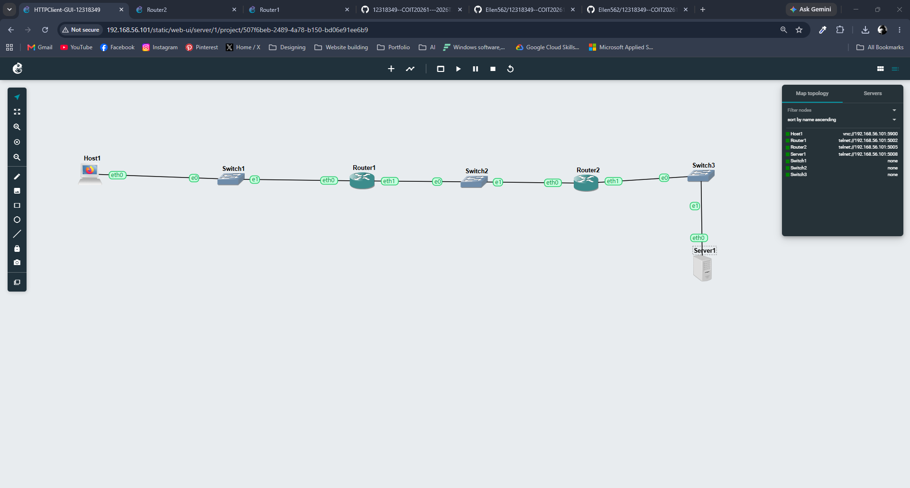
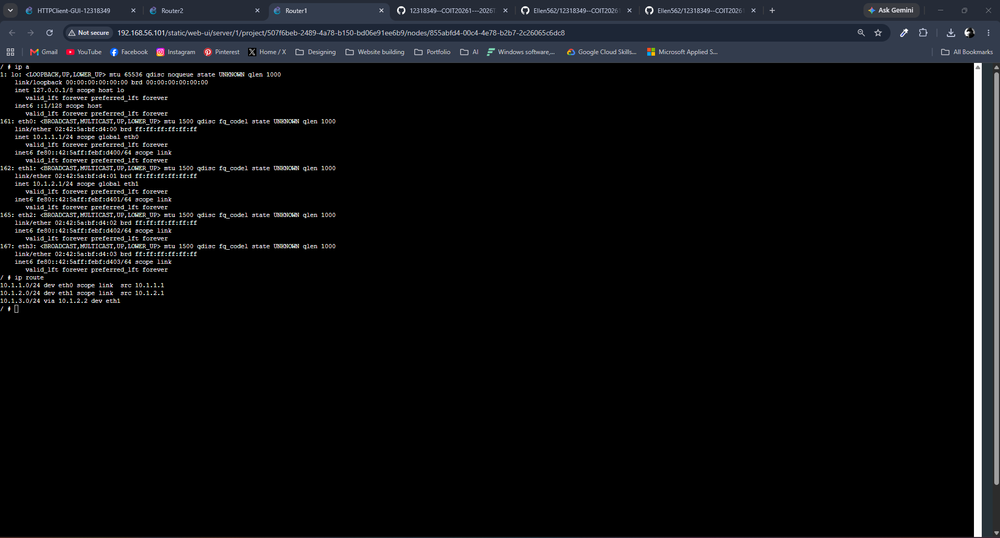
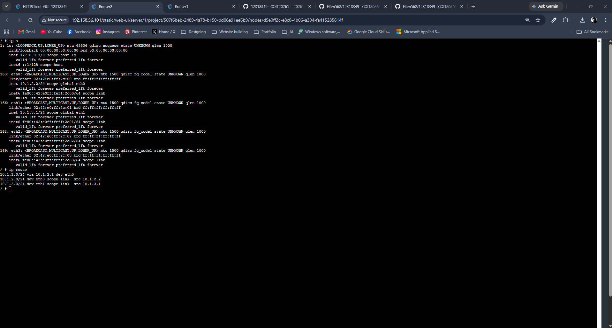
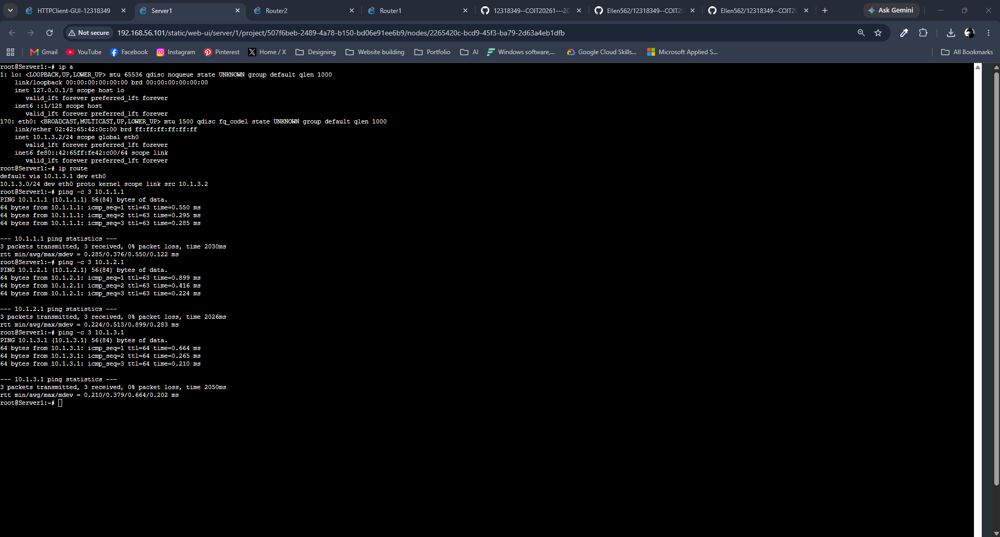
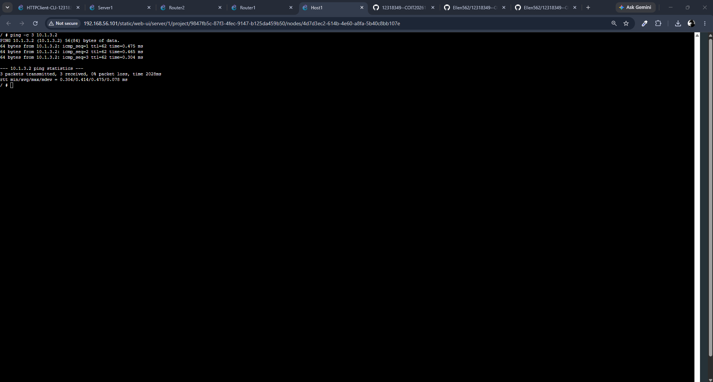
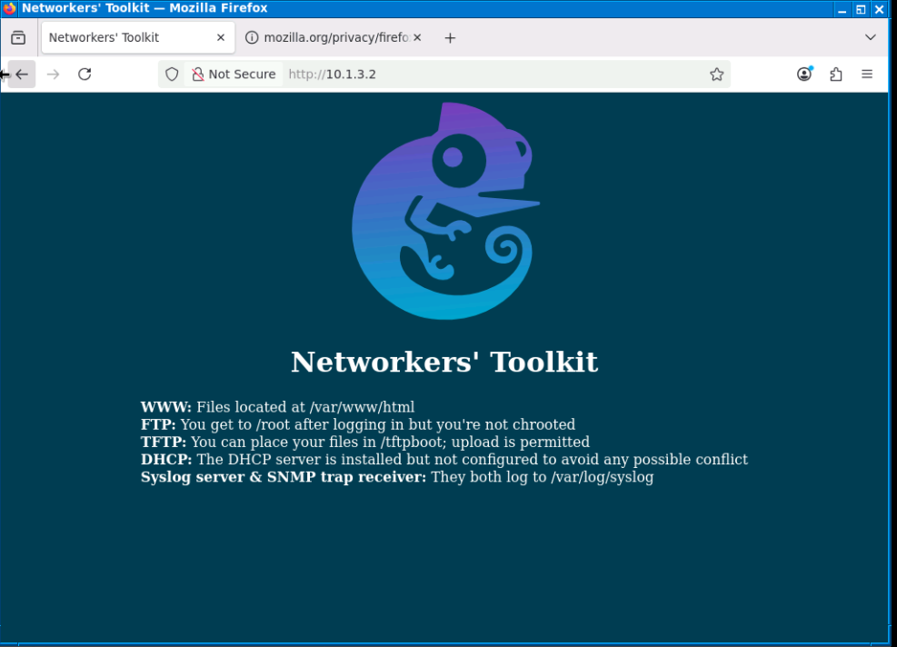
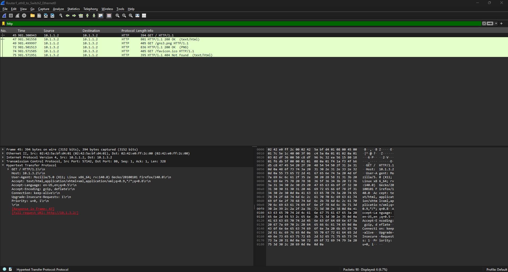
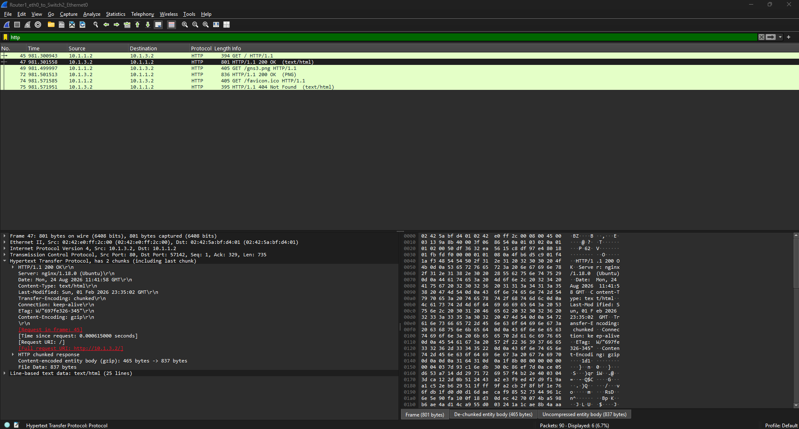

# Week 4 – Network Configuration and HTTP Traffic Analysis

## Overview

In this week's practical, I configured a small network in GNS3 using two routers, a host, switches and a server. I configured the required IP addresses and static routes, tested the connectivity between the devices, accessed the web server and analysed the HTTP traffic using Wireshark.

---

## 1. Network Topology

I created the network topology in GNS3 with Host1 connected to Router1 through Switch1. Router1 and Router2 were connected through Switch2, and Router2 was connected to Server1 through Switch3.

The network used the following three subnets:

- `10.1.1.0/24`
- `10.1.2.0/24`
- `10.1.3.0/24`

---

## 2. Router1 Configuration

I configured Router1 with IP addresses for the networks connected to it.

The routing table showed:

- `10.1.1.0/24` connected through `eth0`
- `10.1.2.0/24` connected through `eth1`
- Route to `10.1.3.0/24` through Router2

This allowed Router1 to forward traffic from the Host1 network towards the Server1 network.

---

## 3. Router2 Configuration

I configured Router2 so that it could communicate with Router1 and the Server1 network.

Router2 was connected to:

- `10.1.2.0/24`
- `10.1.3.0/24`

A route was also configured for the `10.1.1.0/24` network through Router1.

---

## 4. Server1 Connectivity Test

Server1 was configured with the IP address `10.1.3.2/24` and the default gateway was set to `10.1.3.1`.

I tested connectivity from Server1 to the network using ping. The successful replies confirmed that Server1 could communicate with the routers.

---

## 5. Host1 to Server1 Connectivity Test

Host1 was configured with the IP address `10.1.1.2/24` and used `10.1.1.1` as its default gateway.

I then pinged Server1 at `10.1.3.2`. The ping replies were successful with no packet loss. This confirmed that routing between the `10.1.1.0/24` and `10.1.3.0/24` networks was working correctly.

---

## 6. Accessing the Web Server

After confirming network connectivity, I opened Firefox on Host1 and entered:

`http://10.1.3.2`

The Networkers' Toolkit webpage loaded successfully. This confirmed that Host1 could access the HTTP web server running on Server1 across the routed network.

---

## 7. HTTP GET Request Analysis

I captured the network traffic using Wireshark and applied the following display filter:

`http`

I selected the HTTP request packet sent from Host1 (`10.1.1.2`) to Server1 (`10.1.3.2`).

The packet showed:

- Source: `10.1.1.2`
- Destination: `10.1.3.2`
- Protocol: HTTP
- Method: `GET`
- Request: `GET / HTTP/1.1`
- Host: `10.1.3.2`

This showed that Host1 requested the webpage from Server1 using HTTP.

---

## 8. HTTP 200 OK Response Analysis

I then selected the HTTP response packet sent from Server1 back to Host1.

The packet showed:

- Source: `10.1.3.2`
- Destination: `10.1.1.2`
- Protocol: HTTP
- Status: `HTTP/1.1 200 OK`
- Content-Type: `text/html`

The `200 OK` response confirmed that Server1 successfully received the HTTP request and returned the webpage to Host1.

---

## Reflection

In this week's practical, I learned how devices on different networks can communicate through routers. I configured IP addresses and static routes between three different networks and tested the connection using ping.

I also accessed an HTTP web server from Host1 and used Wireshark to examine the communication between the client and server. I was able to identify the HTTP GET request sent by Host1 and the `200 OK` response returned by Server1.

This practical helped me better understand static routing, end-to-end network connectivity and how HTTP communication can be viewed at packet level using Wireshark.
