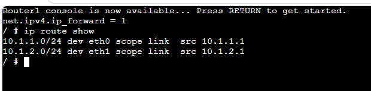
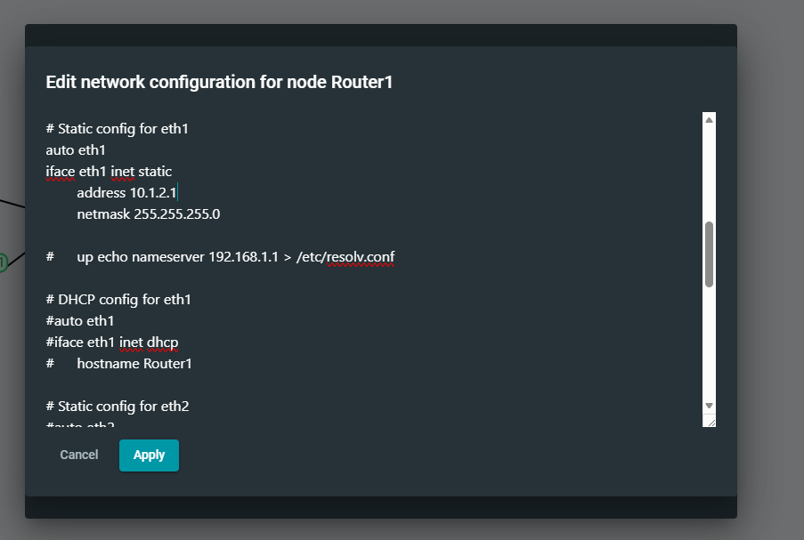
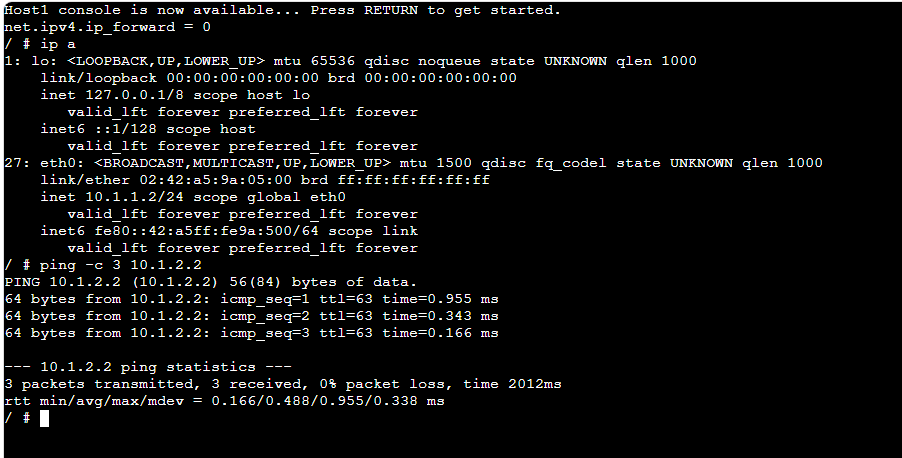
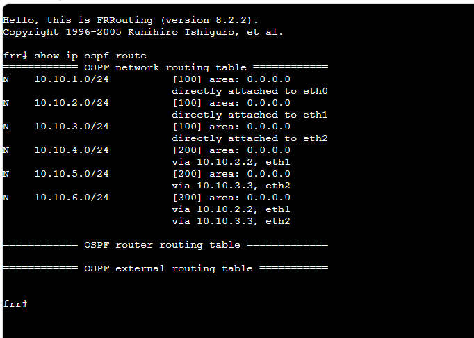
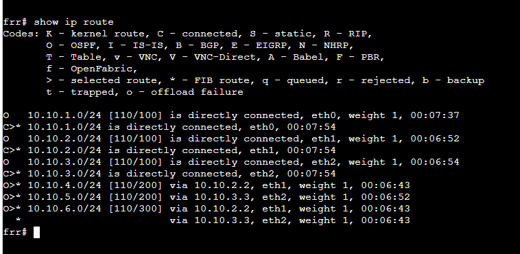
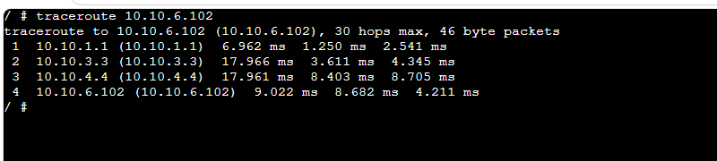
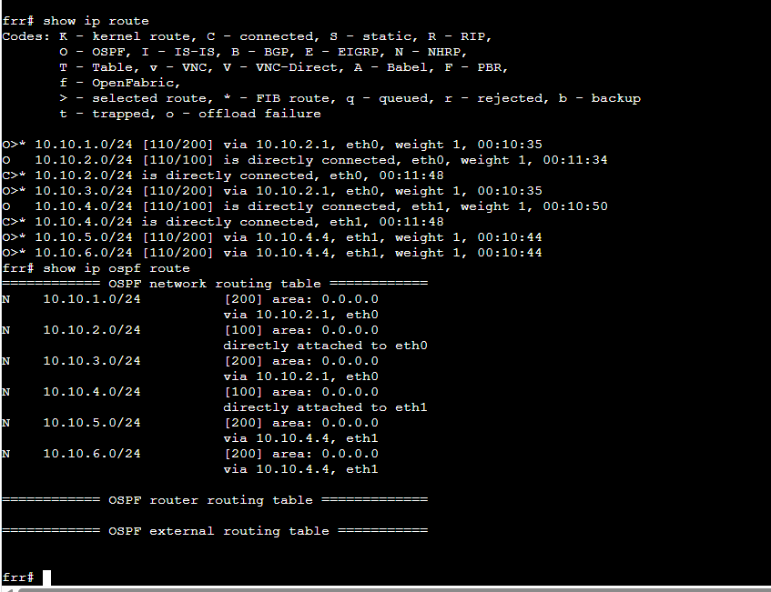
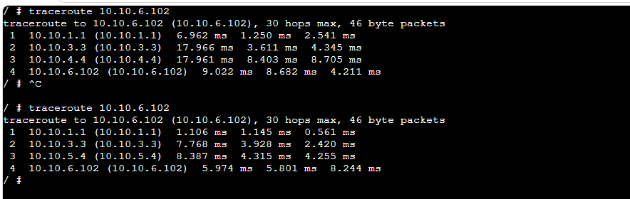

# Week 5 – Routing Tables and Dynamic Routing with OSPF

## Overview

In this week's practical, I worked with routing tables, IP forwarding and dynamic routing using OSPF. I first configured a basic routed network and tested communication between different subnets. I then used FRRouting (FRR) to examine OSPF routes and used traceroute to see how packets travelled through the network.

---

# Task 1 – View Routing Tables

## 1. Router1 Network Configuration

I configured the network interfaces on Router1 using static IPv4 addresses. The router was used to connect the different subnets.

The router interface configuration included the required IP address and subnet mask.

---

## 2. IP Forwarding and Routing Table

I enabled IPv4 forwarding on Router1 so that it could forward packets between different networks.

I then used the routing table to check the networks connected to Router1.

The routing table showed:

- `10.1.1.0/24` through `eth0`
- `10.1.2.0/24` through `eth1`

This confirmed that Router1 had routes to both directly connected networks.

---

## 3. Testing Connectivity

After configuring the network, I tested the connection from Host1 using the ping command.

Host1 successfully received replies from `10.1.2.2`.

The result showed:

- 3 packets transmitted
- 3 packets received
- 0% packet loss

This confirmed that Router1 was successfully forwarding packets between the two subnets.

---

# Task 2 – Dynamic Routing with OSPF

## 4. Viewing OSPF Routes

For the second task, I used the provided OSPF network with FRRouting.

I used the following command to examine the OSPF routing information:

`show ip ospf route`

The output showed directly connected networks as well as networks learned dynamically through OSPF.

For example, the routing information included networks such as:

- `10.10.1.0/24`
- `10.10.2.0/24`
- `10.10.3.0/24`
- `10.10.4.0/24`
- `10.10.5.0/24`
- `10.10.6.0/24`

Some networks were directly attached while other networks were reached through neighbouring routers.

---

## 5. FRR IP Routing Table

I also used the following command:

`show ip route`

This displayed the complete routing table used by the FRR router.

The routes marked with `O` were learned through OSPF, while connected networks were shown as directly connected.

The routing table also showed the next-hop router used to reach remote destination networks.

---

## 6. Traceroute Before Link Failure

I used traceroute to check the path from the source host to destination `10.10.6.102`.

The initial traceroute showed the following path:

`10.10.1.1 → 10.10.3.3 → 10.10.4.4 → 10.10.6.102`

This allowed me to see each router that the packet passed through before reaching the destination.

---

## 7. Routing Table After Network Change

I examined the routing information again to see how OSPF was managing routes through the network.

The routing table showed both directly connected networks and routes learned dynamically through neighbouring routers.

This demonstrated how OSPF automatically maintains routing information instead of requiring every remote route to be entered manually.

---

## 8. Traceroute After Link Disconnection

After changing the network by disconnecting one of the links, I performed traceroute again.

The new traceroute showed:

`10.10.1.1 → 10.10.3.3 → 10.10.5.4 → 10.10.6.102`

The path changed compared with the original traceroute.

Before:

`10.10.1.1 → 10.10.3.3 → 10.10.4.4 → 10.10.6.102`

After:

`10.10.1.1 → 10.10.3.3 → 10.10.5.4 → 10.10.6.102`

This demonstrated how OSPF can dynamically update routing information when a network path becomes unavailable.

---

## Reflection

In this week's practical, I learned how routing tables are used to forward packets between different networks. I configured IP addresses, enabled IP forwarding on a router and tested the network using ping.

I also learned how OSPF provides dynamic routing. By using FRRouting commands, I was able to examine OSPF routes and identify how remote networks were reached through neighbouring routers.

The traceroute tests helped me understand how packets travel through multiple routers. When the network path changed, OSPF was able to use another available route. This helped me understand one of the main advantages of dynamic routing compared with manually configured static routes.
