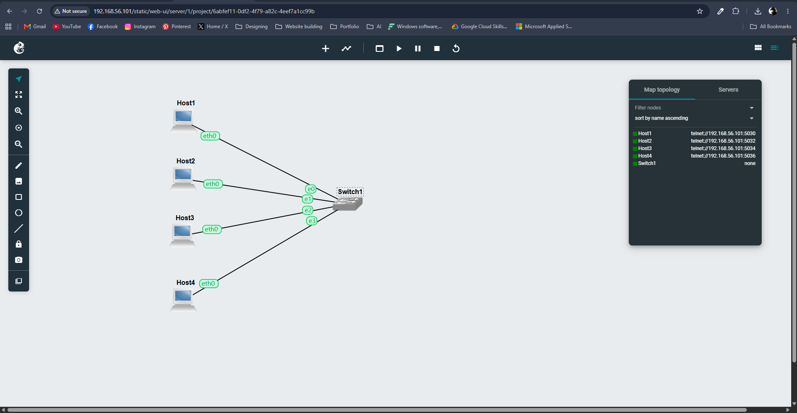
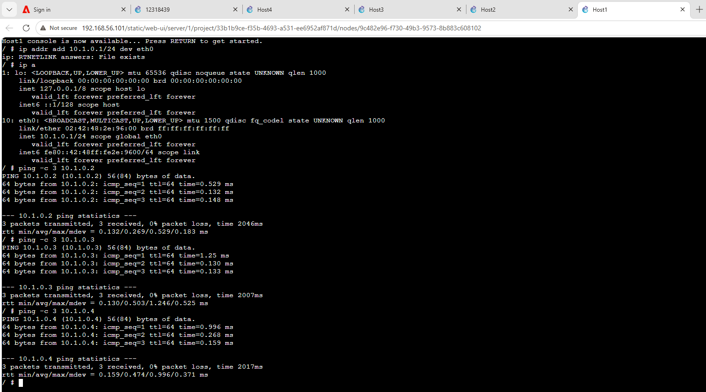
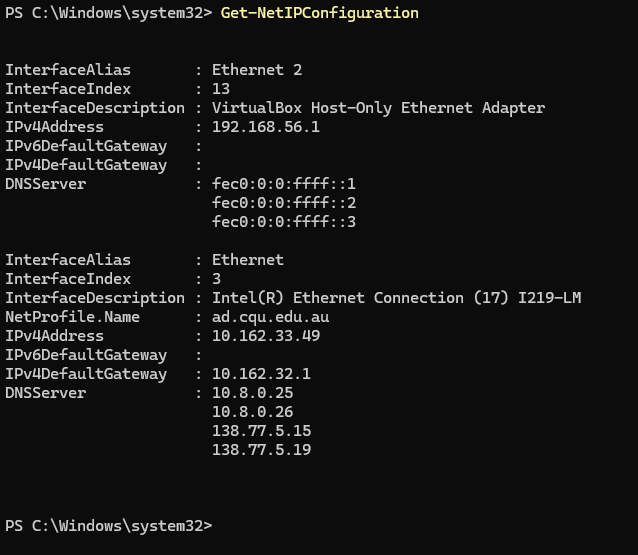
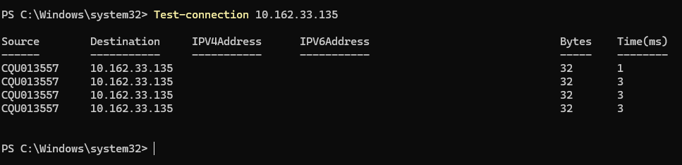

# COIT20261 Network Services and Automation
## Week 03 Tutorial Journal

## Task 1: Simple Application Communications with Netcat

### 1. Network Setup

For this week's tutorial, I created a GNS3 network containing four Linux hosts named **Host1, Host2, Host3 and Host4**. All four hosts were connected to the same Ethernet switch.



**Figure 1: Week 03 GNS3 network topology.**

I configured the hosts using the following IPv4 addresses:

| Host | IPv4 Address |
|---|---|
| Host1 | 10.1.0.1/24 |
| Host2 | 10.1.0.2/24 |
| Host3 | 10.1.0.3/24 |
| Host4 | 10.1.0.4/24 |

---

### 2. Testing Connectivity

Before using Netcat, I checked whether Host1 could communicate with the other hosts.

From Host1, I used:

```bash
ping -c 3 10.1.0.2
ping -c 3 10.1.0.3
ping -c 3 10.1.0.4
```

All three destinations responded successfully with `0% packet loss`.



**Figure 2: Testing connectivity from Host1 to Host2, Host3 and Host4.**

This confirmed that the IP configuration was working and the hosts could communicate through the switch.

---

### 3. Starting the Netcat Server

For the Netcat activity, I used **Host2 as the server**.

I started Netcat in listening mode on port `12346` using:

```bash
nc -l -p 12346
```

I used port `12346` instead of the example port `12345`.

After starting the server, it waited for an incoming connection from the Netcat client.


**Figure 3: Netcat server listening on port 12346.**

---

### 4. Connecting the Netcat Client

I used **Host1 as the Netcat client**.

Since Host2 was using the IP address `10.1.0.2`, I connected to the Netcat server using:

```bash
nc 10.1.0.2 12346
```

After the connection was established, text messages could be exchanged between the client and server.


**Figure 4: Netcat client connected to Host2 on port 12346.**

---

### 5. Sending Messages Using Netcat

After establishing the connection, I sent a name through the Netcat connection.

The message sent was:

```text
Ellen
```

The student ID sent through the connection was:

```text
12318349
```

Both messages appeared on the connected consoles, confirming that the Netcat client and server were communicating successfully.

This activity showed that Netcat can be used to test simple application-level communication between two hosts using a specified port.

---

## Task 2: Capturing Packets

### 1. Starting Packet Capture

For the second task, I captured network traffic travelling between a Linux host and the Ethernet switch.

I started the packet capture on the link between Host1 and Switch1 in GNS3.

The capture was configured as an Ethernet capture and saved in `.pcap` format.

---

### 2. Generating Ping Traffic

While the packet capture was running, I generated ICMP traffic by sending three ping requests.

The command used was:

```bash
ping -c 3 10.1.0.2
```

The successful ping responses confirmed that Host1 could communicate with Host2.

The ping traffic generated ICMP Echo Request and Echo Reply packets that could be recorded in the packet capture.

---

### 3. Generating Netcat Traffic

I also used Netcat while capturing network traffic.

Netcat created application-level communication between the hosts using TCP and the selected port.

This allowed the packet capture to contain both basic network connectivity traffic from `ping` and application communication generated using Netcat.

---

### 4. Saving the Packet Capture

After generating the required traffic, I stopped the packet capture.

The capture was saved as a `.pcap` file so that the packets could be opened and analysed later using Wireshark.

The capture file was saved as:

```text
Capture-Basics-12318349-ping-netcat.pcap
```

---

## Additional Network Testing

I also checked the Windows network configuration using PowerShell.

The command used was:

```powershell
Get-NetIPConfiguration
```

This displayed information about the Windows network interfaces, including the VirtualBox Host-Only Ethernet Adapter and the physical Ethernet interface.



**Figure 5: Checking the Windows network configuration using PowerShell.**


I then tested connectivity from Windows using:

```powershell
Test-Connection 10.162.33.135
```

The destination successfully responded to the connection test.



**Figure 6: Testing network connectivity using PowerShell Test-Connection.**

---

## What I Learned

In this week's tutorial, I learned how to use different tools to test communication between network devices.

I first used `ping` to confirm that the Linux hosts could communicate with each other. The successful results with `0% packet loss` showed that the IP addresses and network connections were working correctly.

I then used Netcat to create simple client-server communication. I learned how one host can listen on a specific port while another host connects to that IP address and port. After the connection was established, text messages could be exchanged between the two hosts.

I also learned how network traffic can be captured in GNS3 and saved as a `.pcap` file. The capture can later be opened in Wireshark to inspect the packets in more detail.

Overall, this tutorial helped me understand the difference between using `ping` for basic network connectivity testing and using Netcat for application-level communication.
